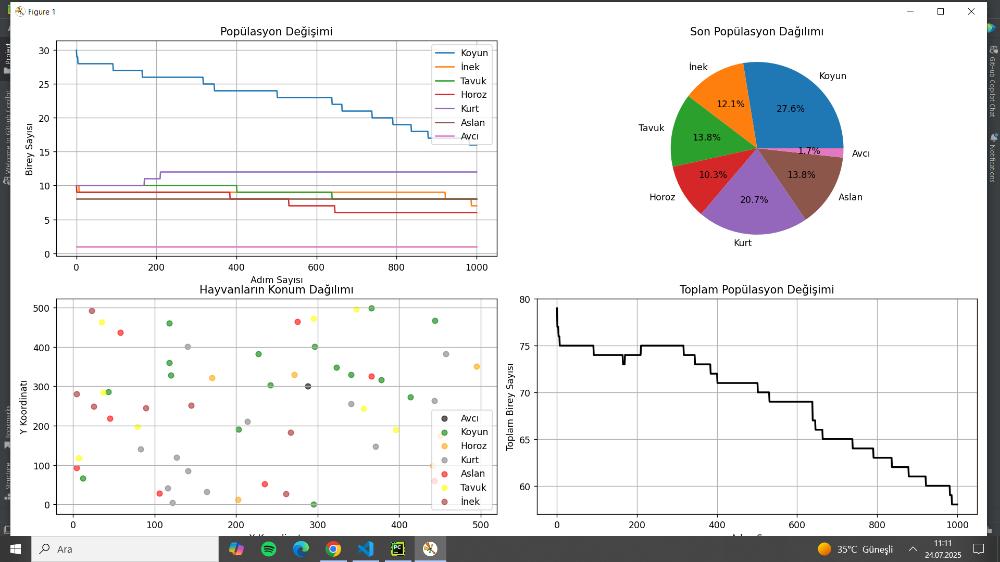

# Hayvan Popülasyon Simülasyonu

## Proje Hakkında

Bu proje, çeşitli hayvan türlerinin (koyun, inek, tavuk, horoz, kurt, aslan, avcı) yer aldığı bir ekosistemde **popülasyon dinamiklerini simüle eden** bir Python programıdır.

Simülasyonda:

- Hayvanlar rastgele bir alanda (500x500 koordinat sisteminde) konumlandırılır,
- Hayvanlar hareket eder,
- Yırtıcılar avlanır,
- Türler uygun koşullarda ürer,
- Popülasyon verileri her adımda kaydedilir ve
- Simülasyon sonunda popülasyonların zaman içindeki değişimi grafiklerle görselleştirilir.

---

## Dosyalar

### 1. `main.py` (Ana simülasyon dosyası)

- Simülasyon döngüsünü çalıştırır.
- Popülasyon oluşturma, hayvan hareketleri, avlanma, üreme, aşırı popülasyon kontrolü gibi mekanikleri içerir.
- Popülasyon verilerini toplayıp grafik olarak gösterir.

### 2. `hayvanlar.py` (Hayvan sınıfları ve temel fonksiyonlar)

- Hayvan türlerini temsil eden sınıflar (`Koyun`, `Inek`, `Tavuk`, `Horoz`, `Kurt`, `Aslan`, `Avci`) burada tanımlıdır.
- Her hayvanın pozisyonu, cinsiyeti, türü, hareket etme ve mesafe hesaplama metodları burada bulunur.

---

## Nasıl Çalışır?

1. `main.py` çalıştırılır.

2. `populasyon_olustur()` fonksiyonu ile başlangıç popülasyonu rastgele oluşturulur.

3. 1000 adıma kadar (ya da popülasyon 50.000'i geçene kadar) simülasyon adımları tekrarlanır:

   - Her hayvan hareket eder.
   - Avcı, kurt ve aslan türleri uygun avları mesafeye göre avlar.
   - Her 10 adımda bir, uygun koşullara sahip hayvanlar ürer.
   - Popülasyon verileri kaydedilir.
   - İlerleme bilgisi 100 adımda bir konsola yazdırılır.

4. Simülasyon sonunda:

   - Türlere göre toplam birey sayıları yazdırılır.
   - Popülasyonun zaman içindeki değişimini gösteren grafikler çizilir.

---



## Kullanım

```bash
python main.py
